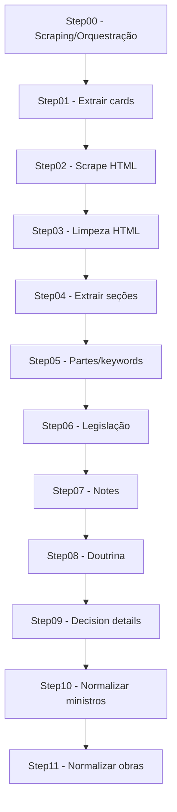

# CITO `poc-v-d33` — Documentação Completa (Arquivo Único)

> Escopo principal deste documento: `versions/development/poc-v-d33/` (web + pipeline core + configs) e suas integrações com MongoDB/LLMs.
>
> Observação de segurança: **este repositório contém credenciais em arquivos de configuração** (ex.: `versions/development/poc-v-d33/config/mongo.yaml`, `versions/development/poc-v-d33/config/providers.yaml`). Esta documentação descreve a estrutura e o uso, **sem reproduzir valores sensíveis**.

## Sumário

1. Visão geral
2. Arquitetura e componentes
3. Requisitos (SRS + UI)
4. Modelo de dados (MongoDB)
5. Pipeline (extração/enriquecimento)
6. Web App (rotas, telas e lógica)
7. Scripts e módulos (catálogo)
8. Configurações
9. Operação, logs e troubleshooting
10. Segurança e boas práticas
11. Glossário

---

## 1. Visão geral

O CITO (versão `poc-v-d33`) é um sistema de:

- Coleta de jurisprudência do STF (busca + páginas de decisão)
- Tratamento e enriquecimento do conteúdo (HTML → seções → extrações via LLM)
- Persistência em MongoDB (coleções `case_query`, `case_data`, `scrape_jobs`, `pipeline_jobs`)
- Interface web (Flask) para análise e navegação por:
  - Processos
  - Ministros
  - Citações (doutrina, legislações, acórdãos e outras notas)
  - Execuções de scraping/pipeline

O identificador canônico de processos é `identity.stfDecisionId`.

---

## 2. Arquitetura e componentes

### 2.1 Estrutura de pastas (principais)

- `versions/development/poc-v-d33/web/`
  - `app.py`: aplicação Flask (rotas, agregações, queries Mongo, orquestração de scraping/pipeline via subprocess)
  - `templates/`: páginas HTML
  - `static/styles.css`: estilos
  - `utils/`: utilitários (Mongo)
- `versions/development/poc-v-d33/core/`
  - `step00-*.py`: scraping e orquestração
  - `step01-*.py`…`step11-*.py`: etapas do pipeline
  - `utils/`: utilitários (Mongo, normalizações, títulos de obras)
  - `templates/`: schemas e documentos auxiliares (ex.: `persistencia-status.md`)
  - `logs/`: logs gerados por pipeline/ações
- `versions/development/poc-v-d33/config/`
  - `mongo.yaml`: conexão MongoDB
  - `query.yaml`: parâmetros da busca no STF
  - `pipeline.yaml`: steps habilitados, run mode, delays
  - `providers.yaml`: provedores/keys de LLM
  - `prompts.yaml`: prompts e schemas de saída para extrações
  - `work_aliases.yaml`: alias de títulos (normalização de obras)

### 2.2 Componentes (alto nível)

1. **Scraping** (STF Search + páginas individuais)
   - `core/step00-search-stf.py` e `core/step02-get-case-html.py`
2. **Pipeline** (etapas sequenciais)
   - `core/step01`…`step11`
3. **Persistência** (MongoDB)
   - `case_query` (execuções de busca e HTML de resultados)
   - `case_data` (processos e enriquecimentos)
   - `scrape_jobs` / `pipeline_jobs` (fila/execuções via UI)
4. **Web UI** (Flask + templates)
   - Dashboards e telas de detalhe consumindo MongoDB e agregações
   - Orquestração de execuções (scraping e pipeline) via UI

---

## 3. Requisitos (SRS + UI)

Esta seção consolida regras e requisitos que guiam a implementação da versão `poc-v-d33`. As fontes principais estão em:

- `docs/requirements/req-v-poc-d33.md` (SRS global do sistema)
- `docs/requirements/srs-ui-melhorias-poc-v-d33.md` (melhorias UI)
- `versions/development/poc-v-d33/reqs/ui-analise-citacoes.md` (UI — Análise de Citações + Ministros)
- Requisitos adicionais implementados durante a evolução da UI (card de filtros colapsável, detalhamento de legislação e regras de contagem/exibição).

### 3.1 Regras globais

1. **Identificador canônico**: o sistema usa `identity.stfDecisionId` como ID primário de processo em links internos, filtros e pipeline.
2. **Status e auditoria**:
   - `status.pipelineStatus`: estado lógico consolidado do documento no pipeline
   - `processing.*`: metadados técnicos (sucesso/erro, timestamps, latência, provider/model, contagens)
   - `audit.*`: rastreabilidade temporal (criação/atualização/extração)
3. **Consistência de links**:
   - Títulos de processo (quando houver `stfDecisionId`) devem linkar para `/processos/<stfDecisionId>`
   - Nomes de ministros devem linkar para `/ministros/detalhe?minister=<nome>`
   - Autores/obras devem linkar para `/analise-citacoes/detalhe?kind=author|title&value=<...>`

### 3.2 UI — requisitos principais

#### 3.2.1 Interface: **Análise de Citações**

Fonte base: `versions/development/poc-v-d33/reqs/ui-analise-citacoes.md` (+ ajustes adicionais implementados).

Requisitos consolidados:

- Renomeação de “Doutrinas” para **“Análise de Citações”** (UI e navegação), mantendo `/doutrina` como redirect para `/analise-citacoes`.
- Remoção de cards antigos não desejados (ex.: Casos por Ano, Total de Casos, etc.).
- Filtros no topo (autor, título, classe, ano, relator), com comportamento padrão do sistema.
- Indicadores (BIG NUMBERS) reorganizados em um card contêiner **“Indicadores Médios”** contendo mini-cards:
  - Total de Autores
  - Total de Obras
  - Total de Legislações
  - Total de Acórdãos
  - Doutrinas por Caso
  - Legislações por Caso
  - Acórdãos por Caso
- Tooltips obrigatórios ao hover no card/indicador inteiro (textos específicos definidos para o card “Indicadores Médios”).
- Card **“Autores Mais Citados”**:
  - Linha exclusiva (100% da largura)
  - Gráfico de rosca (donut) com **15 autores**
  - Sem legenda acima do gráfico (legend desabilitada)
  - Layout interno: gráfico à esquerda e tabela à direita (Autor, nº citações, percentual)
  - Responsivo: gráfico acima da tabela em telas menores
- Card **“Acórdãos mais citados”**:
  - Gráfico de barras com top 10 itens (conforme dados agregados)
- Heatmap **Autores x Ministro**:
  - X: 10 ministros que mais citam doutrina (abreviação + link)
  - Y: 15 autores mais citados (abreviação + link)
  - Célula: nº de citações (escala de cores)
- Tabelas com “Ver mais”:
  - Autores (top 10 + paginação)
  - Obras (top 10 + paginação; truncamento + tooltip)
  - Legislações (top 10 + paginação)
  - Acórdãos (top 10 + paginação)

#### 3.2.2 Interface: **Análise de Ministros**

Fonte base: `versions/development/poc-v-d33/reqs/ui-analise-citacoes.md`.

Requisitos consolidados:

- Renomear “Interface 2: Ministros” para **“Análise de Ministros”**.
- Filtros: Ministro, Classe processual, Ano de julgamento, Relator, Intervalo de datas.
- BIG NUMBERS em uma única linha com 5 cards (mesma largura):
  - Total de Ministros
  - Média de casos por Ministro
  - Doutrinas por Ministro (média por caso)
  - Legislações por Ministro (média por caso)
  - Acórdãos por Ministro (média por caso)
- Métricas de atuação:
  - Barras: 10 ministros mais ativos como relatores (nº de relatorias)
  - Rosca: 7 ministros com maior participação (percentual)
- Tabela detalhada com tooltips e links:
  - Nome abreviado e link para detalhe do ministro
  - Casos, Relatorias, Casos/Ano
  - “Citado” com tooltip decompondo por tipo
  - “Autores” com tooltip explicativo

#### 3.2.3 Interface: **Detalhe do Ministro**

Requisitos consolidados:

- Todos os cards/tabelas com listagens devem limitar exibição inicial a **10 itens**, com opção **“Ver mais”**.
- Tooltips nos nomes de cada card/indicador explicando a métrica.

Implementação: paginação por query params na rota `/ministros/detalhe`.

#### 3.2.4 Interface: **Detalhe do Processo**

Requisitos consolidados:

- A decisão final deve ser lida de `caseData.decisionDetails.finalDecision`.
- O voto de cada ministro deve ser lido de `caseData.decisionDetails.ministerVotes[].voteType`.
- Cards “Partes do Processo” e “Votos dos Ministros” exibidos na **mesma linha**.
- Limite inicial de 10 itens em cada card, com opção de expandir (“Exibir mais”/“Ver mais”).

#### 3.2.5 Legislação — regras de exibição, contagem e navegação (RF-LEG-001…005)

Requisitos consolidados:

1. Em listagens (tabelas/listas/tag clouds), exibir **somente `normIdentifier`** por item visual.
2. Contagem de citações legislativas deve considerar **cada item em `normReferences`**:
   - `citacoes_da_norma = len(legislationReferences[*].normReferences)` para o `normIdentifier`
3. `normIdentifier` deve ser clicável e abrir detalhe da legislação.
4. Tela de detalhe de legislação deve exibir:
   - métricas principais derivadas das citações (ex.: total de citações, total de processos)
   - tabela com **todas** as citações detalhadas (linhas de `normReferences`)

Implementação: rota `/legislacoes/detalhe?norm=<normIdentifier>`.

---

## 4. Modelo de dados (MongoDB)

### 4.1 Coleções

- `case_query`:
  - Uma execução de busca no STF (HTML bruto + metadados de query)
  - Usada como “run” na UI de scraping
- `case_data`:
  - Documento canônico do processo e todos os enriquecimentos
- `scrape_jobs`:
  - Agendamentos/execuções de scraping disparadas pela UI
- `pipeline_jobs`:
  - Execuções do pipeline disparadas pela UI para um `case_query` (rodar/reprocessar)

### 4.2 `case_query` (campos principais)

Campos típicos (ver `docs/system/poc-v-d33/data-dictionary.md`):

- `_id`: ObjectId
- `queryString`, `pageSize`, `inteiroTeor`, `queryUrl`
- `htmlRaw`: HTML bruto retornado na página de resultados
- `status`: `new` | `extracting` | `extracted` | `error`
- `extractionTimestamp`, `processedDate`, `extractedCount`

### 4.3 `case_data` (estrutura principal)

Documentação de referência:

- Schema: `versions/development/poc-v-d33/core/templates/schema_case_data.json`
- Documentação: `versions/development/poc-v-d33/core/templates/schema_case_data_doc.md`
- Fluxo por step: `versions/development/poc-v-d33/core/templates/flow_case_data_fields.md`
- Persistência de status: `versions/development/poc-v-d33/core/templates/persistencia-status.md`

#### 4.3.1 Raiz do documento

- `_id`: ObjectId
- `identity`: identificação do processo (inclui `stfDecisionId`)
- `dates`: datas normalizadas (julgamento/publicação etc.)
- `caseContent`: HTML bruto/limpo e seções em raw/markdown
- `caseData`: campos estruturados extraídos (partes, keywords, legislação, doutrina, notas, decisão)
- `processing`: metadados por etapa (status/erro/timestamps/latência)
- `status`: macro-status do pipeline (`pipelineStatus`)
- `audit`: timestamps e rastreabilidade

#### 4.3.2 `identity` (exemplos de campos usados pela UI)

- `identity.stfDecisionId` (ID canônico interno)
- `identity.caseTitle`
- `identity.caseClass`, `identity.caseNumber`
- `identity.judgingBody`
- `identity.rapporteur`
- `identity.caseUrl` (link externo)
- `identity.caseQueryId` (vincula ao run de `case_query`)

#### 4.3.3 `caseData` (campos principais)

- `caseData.caseParties[]`: partes (tipo/nome)
- `caseData.caseKeywords[]`: palavras-chave
- `caseData.doctrineReferences[]`: citações doutrinárias
  - após normalização (step11), podem incluir:
    - `publicationTitleRaw`
    - `publicationTitleNorm`
    - `publicationTitleDisplay`
    - `workKey`, `workMatchType`
- `caseData.legislationReferences[]`:
  - `normIdentifier` (ex.: `CF-1988`, `LEI-8112-1990`)
  - `normType`, `normYear`, `jurisdictionLevel`, `normDescription`
  - `normReferences[]` (artigo/inciso/parágrafo/alínea etc.)
- `caseData.notesReferences[]`:
  - inclui itens (ex.: `stf_acordao`) em `items[]`
- `caseData.decisionDetails`:
  - **Decisão final (UI)**: `caseData.decisionDetails.finalDecision`
    - Compatibilidade: bases antigas podem usar `caseData.decisionDetails.decisionResult.finalDecision`
  - **Votos**: `caseData.decisionDetails.ministerVotes[]` e `voteType`
  - outros campos variam conforme o prompt/extração

### 4.4 `scrape_jobs` (esquema de alto nível)

Persistido pela UI (`web/app.py`):

- `_id`: ObjectId
- `status`: `scheduled` | `running` | `completed` | `failed` | `canceled`
- `scheduledFor`, `createdAt`, `updatedAt`, `startedAt`, `finishedAt`
- `query`: objeto com parâmetros de busca (term, classes, datas, etc.)
- `runId`: UUID da execução
- `logPath`: arquivo de log em `versions/development/poc-v-d33/core/logs/`
- `caseQueryId`: `_id` do `case_query` associado (quando encontrado)
- `resultCount`: total extraído
- `error` / `lastError`

### 4.5 `pipeline_jobs` (esquema de alto nível)

Persistido pela UI (`web/app.py`):

- `_id`: ObjectId
- `caseQueryId`: string do `_id` de `case_query`
- `action`: `run` | `reprocess`
- `status`: `scheduled` | `running` | `completed` | `failed` | `canceled`
- `runId`: UUID da execução
- `logPath`: caminho esperado para logs
- `createdAt`, `updatedAt`, `startedAt`, `finishedAt`
- `source`: `ui`

---

## 5. Pipeline (extração/enriquecimento)

### 5.1 Visão geral do pipeline

O pipeline é composto por scripts Python (`core/stepXX-*.py`). O fluxo típico é:

1. Buscar resultados do STF (gera `case_query`)
2. Extrair cards de processo (upsert em `case_data`)
3. Para cada `stfDecisionId`, baixar HTML, limpar, extrair seções
4. Extrair partes/keywords
5. Extrair (LLM) legislação, notas, doutrina, detalhes da decisão
6. Normalizar nomes/títulos (steps 10/11)

Diagrama (referência): `versions/development/poc-v-d33/core/templates/flow_case_data_fields.md`



### 5.2 Scripts do pipeline (catálogo)

Local: `versions/development/poc-v-d33/core/`

- `step00-search-stf.py`
  - Input: `config/query.yaml` (ou arquivo temporário gerado pela UI)
  - Output: documento em `case_query` com `htmlRaw`
- `step01-extract-cases.py`
  - Input: `case_query.htmlRaw` (filtrado por `--case-query-id`)
  - Output: upsert em `case_data` (`identity`, `dates`, auditoria/status base)
- `step02-get-case-html.py`
  - Input: `identity.stfDecisionId`
  - Output: `caseContent.caseHtml` (+ metadados `processing.caseScrape*`)
  - Observação: pode usar Playwright se detectar challenge
- `step03-clean-case-html.py`
  - Input: `caseContent.caseHtml`
  - Output: `caseContent.caseHtmlClean`
- `step04-extract-sessions.py`
  - Input: `caseContent.caseHtmlClean`
  - Output: `caseContent.raw.*` e `caseContent.md.*`
- `step05-extract-keywords-parties.py`
  - Input: `caseContent.md.parties` / `caseContent.md.keywords`
  - Output: `caseData.caseParties`, `caseData.caseKeywords`
- `step06-extract-legislation-mistral.py`
  - Input: `caseContent.md.legislation`
  - Output: `caseData.legislationReferences`
- `step07-extract-notes-mistral.py`
  - Input: `caseContent.md.notes`
  - Output: `caseData.notesReferences`
- `step08-doctrine-mistral.py`
  - Input: `caseContent.md.doctrine`
  - Output: `caseData.doctrineReferences`
- `step09-extract-decision-details-mistral.py`
  - Input: `caseContent.md.decision`
  - Output: `caseData.decisionDetails`
- `step10-normalize-minister-names.py`
  - Normaliza nomes em: `identity.*`, `caseIdentification.*`, `caseData.decisionDetails.ministerVotes[]`
- `step11-normalize-work-titles.py`
  - Normaliza títulos em `caseData.doctrineReferences[]` usando `config/work_aliases.yaml`

### 5.3 Orquestração

#### 5.3.1 Execução manual

Os steps aceitam entrada via stdin ou argumentos (varia por script). Exemplos:

```bash
python versions/development/poc-v-d33/core/step00-search-stf.py --query-config versions/development/poc-v-d33/config/query.yaml
python versions/development/poc-v-d33/core/step01-extract-cases.py --case-query-id <CASE_QUERY_OBJECT_ID>
```

#### 5.3.2 Execução via orquestradores

- `core/step00-run-pipeline.py`: executa um conjunto fixo (02–08) para documentos sem scrape.
- `core/step00-run-pipeline-02-09.py`: executa steps 02–09 e respeita `config/pipeline.yaml`.
- `core/step00-run-pipeline-from-case-query.py`: executa pipeline a partir de `case_query` (modo utilitário para runs específicos).
- `web/app.py`: dispara scripts via `subprocess` e registra jobs em `scrape_jobs` e `pipeline_jobs`.

### 5.4 Status e persistência

Referência completa: `versions/development/poc-v-d33/core/templates/persistencia-status.md`.

Princípios:

- Sempre atualizar `audit.updatedAt` ao gravar mudanças relevantes.
- Cada step deve gravar em `processing.<step>*` e, em sucesso, alinhar `status.pipelineStatus`.
- Erros podem registrar em `processing.*Error` sem necessariamente avançar `status.pipelineStatus`, conforme regra de cada step.

### 5.5 Prompts/LLM e protocolos de saída

Referência: `docs/system/poc-v-d33/ai-prompts.md` e `versions/development/poc-v-d33/config/prompts.yaml`.

Prompts principais (IDs usados no core):

- Legislação (step06): `extract-legislation-from-md` → **protocolo N/R**
- Notas (step07): `extract-notes-from-md` → **protocolo CITO-REF/1**
- Doutrina (step08): `extract-doctrines-from-md` → **protocolo CITO-DOCTRINE/1**
- Detalhes da decisão (step09): `get_decision-details-stf` → **JSON**

#### 5.5.1 Legislação — protocolo N/R (step06)

O step06 espera que o LLM responda em linhas:

- `N|<id>|<jur>|<tipo>|<ano>|<desc>` (define a norma corrente)
- `R|<art>|<caput?>|<inc?>|<par?>|<par_unico?>|<letra?>` (define um dispositivo vinculado à última norma `N|...`)

Essas linhas são parseadas e normalizadas para `caseData.legislationReferences[]` com `normIdentifier` e `normReferences[]`.

#### 5.5.2 Notas — protocolo CITO-REF/1 (step07)

Formato em blocos com cabeçalho e itens:

- `H|...` (header/tipo)
- `L|...` (linha raw)
- `I|...` (item)
- `M|...` (metadados)

Os itens são persistidos em `caseData.notesReferences[]`.

#### 5.5.3 Doutrina — protocolo CITO-DOCTRINE/1 (step08)

Formato em linhas do tipo:

- `C|author|publicationTitle|edition|publicationPlace|publisher|year|page|rawCitation`

Persistido em `caseData.doctrineReferences[]`.

#### 5.5.4 Detalhes da decisão — JSON (step09)

O step09 espera JSON válido (com tolerância a reparo simples) e persiste em `caseData.decisionDetails`.

Observação importante (compatibilidade de campo):

- A UI foi padronizada para ler a decisão final em `caseData.decisionDetails.finalDecision`.
- Extrações legadas do step09 podem persistir em `caseData.decisionDetails.decisionResult.finalDecision`.

Se sua base ainda estiver no formato legado, é necessário ajustar o pipeline/migração para popular `finalDecision` no nível raiz do `decisionDetails`.

---

## 6. Web App (rotas, telas e lógica)

### 6.1 Execução

Arquivo principal:

- `versions/development/poc-v-d33/web/app.py`

Execução local (debug):

```bash
python versions/development/poc-v-d33/web/app.py
```

### 6.2 Rotas (atualizadas)

Rotas web:

- `/` → redirect para `/analise-citacoes`
- `/doutrina` → redirect para `/analise-citacoes` (compatibilidade)
- `/analise-citacoes` → dashboard principal (Análise de Citações)
- `/analise-citacoes/detalhe` → detalhe por `kind` (`author|title|rapporteur`) e `value`
- `/legislacoes/detalhe` → detalhe de legislação por `normIdentifier` (`norm=...`)
- `/processos` → dashboard de processos
- `/processos/kpis` → endpoint JSON (KPIs com filtros aplicados)
- `/processos/<process_id>` → detalhe do processo (por `_id` Mongo ou `identity.stfDecisionId`)
- `/ministros` → dashboard (Análise de Ministros)
- `/ministros/detalhe` → detalhe do ministro (com paginação por card)
- `/scraping` → painel de scraping (jobs + execuções recentes)
- `/scraping/<run_id>` → detalhe de um run (`case_query._id`) e status por step

Rotas de ação:

- `POST /scraping/schedule`
- `POST /scraping/cancel/<job_id>`
- `POST /scraping/execute/<job_id>`
- `POST /scraping/<run_id>/pipeline/run`
- `POST /scraping/<run_id>/pipeline/reprocess`
- `POST /scraping/<run_id>/pipeline/cancel`

### 6.3 Telas e templates

Templates principais em `versions/development/poc-v-d33/web/templates/`:

- `analise_citacoes.html`: painel “Análise de Citações”
- `analise_citacoes_detail.html`: detalhe (autor/obra/relator)
- `legislacao_detail.html`: detalhe de legislação (normIdentifier + normReferences)
- `processos.html`: painel “Processos”
- `processos_detail.html`: detalhe do processo
- `ministros.html`: painel “Análise de Ministros”
- `ministro_detail.html`: detalhe do ministro
- `scraping.html`: painel de scraping
- `scraping_detail.html`: detalhe de um run de scraping
- `base.html`: layout base + JS global (ex.: colapsar filtros)

### 6.4 Padrões de UI implementados

1. **Card de filtros colapsável**:
   - Classe `filter-panel`, default `is-collapsed`
   - Toggle por botão com `data-filter-toggle`
   - JS global em `base.html`
   - Requisito: colapsar/expandir **não limpa** valores
2. **Paginação “Ver mais”**:
   - Implementada via incremento de `limit`/`*_limit` em query params
3. **Tooltips**:
   - Indicadores do card “Indicadores Médios” possuem tooltips (title) no card inteiro
   - Detalhe do ministro adiciona tooltips em indicadores e títulos de cards

### 6.5 Regras de contagem e exibição (pontos críticos)

#### 6.5.1 Legislação (exibição vs contagem)

- **Exibição** em listagens: 1 item visual por `normIdentifier`
- **Contagem**: soma de `len(normReferences)` por `normIdentifier`

Implementado em `web/app.py` com helper `_norm_references_count()` e agregações que somam `_refCount`.

#### 6.5.2 Decisão final e votos

- Decisão final/resultado: `caseData.decisionDetails.finalDecision`
- Voto por ministro: `caseData.decisionDetails.ministerVotes[].voteType`

---

## 7. Scripts e módulos (catálogo)

### 7.1 Módulos/arquivos principais (com responsabilidade)

#### Web

- `versions/development/poc-v-d33/web/app.py`
  - Rotas Flask
  - Agregações (MongoDB)
  - Normalizações de rótulos (decisão/voto)
  - Orquestração de scraping/pipeline via UI
- `versions/development/poc-v-d33/web/utils/mongo.py`
  - Leitura de `mongo.yaml` e criação de `MongoClient`/collections
- `versions/development/poc-v-d33/web/static/styles.css`
  - Estilos dos cards, tabelas, chips, heatmap, grids

#### Core

- `versions/development/poc-v-d33/core/utils/mongo.py`
  - Conexão Mongo (mesmo utilitário do web)
- `versions/development/poc-v-d33/core/utils/normalize.py`
  - Normalização determinística de nomes de ministros/relatores
- `versions/development/poc-v-d33/core/utils/work_normalize.py`
  - Normalização de títulos de obras e geração de `workKey`

### 7.2 Catálogo de funções (Web `app.py`)

`web/app.py` possui funções agrupáveis por domínio. Principais grupos:

1. Conexão/config:
   - `_get_collection()`, `_get_db()`, `_get_*_collection()`, `_load_query_defaults()`, `_load_pipeline_steps()`
2. Normalização/utilitários:
   - `_normalize_decision_text()`, `_normalize_vote_label()`, `_vote_badge_class()`
   - `_normalize_norm_identifier()`, `_norm_references_count()`, `_format_norm_reference()`
3. Filtros e match:
   - `_get_filters()`, `_get_process_filters()`, `_get_ministro_filters()`
   - `_build_match()`, `_build_process_match()`, `_build_ministro_case_match()`, `_build_minister_match()`, `_build_relatoria_match()`
4. Agregações e consultas:
   - Autores/obras: `_aggregate_authors()`, `_aggregate_works()`
   - Legislação/acórdãos: `_aggregate_legislations()`, `_aggregate_acordaos()`
   - Heatmap: `_aggregate_author_minister_heatmap()`
   - KPIs de processos: `_aggregate_process_kpis()`, `_aggregate_reference_totals()`
5. Detalhes:
   - Processos: `_fetch_process_detail()`
   - Autor: `_fetch_author_citations()`, `_aggregate_author_insights()`
   - Legislação: `_fetch_legislation_detail()`
   - Ministro: `_aggregate_minister_detail()`, `_fetch_relatoria_cases()`
6. Rotas:
   - `analise_citacoes()`, `analise_citacoes_detail()`
   - `processos()`, `processos_detail()`, `processos_kpis()`
   - `ministros()`, `ministro_detail()`
   - `legislacao_detail()`
   - `scraping*` (UI de scraping/pipeline)

---

## 8. Configurações

Local: `versions/development/poc-v-d33/config/`

### 8.1 `mongo.yaml`

Estrutura esperada:

```yaml
mongo:
  uri: "<MONGO_URI>"
  database: "<DB_NAME>"
```

Usado por:

- `core/utils/mongo.py`
- `web/utils/mongo.py`
- scripts do pipeline e UI

### 8.2 `providers.yaml`

Contém providers (ex.: `mistral`, `groq`), defaults e múltiplas keys. Deve ser tratado como **secreto**.

### 8.3 `prompts.yaml`

Define templates de prompts e, quando aplicável, schemas/formatos de saída esperados para:

- Legislação (step06)
- Notas (step07)
- Doutrina (step08)
- Detalhes de decisão (step09)

### 8.4 `pipeline.yaml`

Configura:

- `run_mode` (all/one)
- filtro por status
- steps habilitados e `input_format`
- delays e tolerância a erro
- diretórios de log/saída

### 8.5 `query.yaml`

Configura:

- termo de busca (`query_string`)
- `full_text`
- paginação e ordenação
- filtros por classes processuais
- delays e opções HTTP

### 8.6 `work_aliases.yaml`

Lista de obras canônicas e variantes, usada no step11 para normalização (alias → canonical).

---

## 9. Operação, logs e troubleshooting

### 9.1 Dependências

Pacotes Python em `requirements.txt`:

- `pymongo`, `requests`, `pyyaml`, `beautifulsoup4`, `markdownify`, `playwright`, `groq`, `flask`, `certifi`

Observação: se o scraping exigir Playwright, é necessário instalar browsers (ex.: `playwright install`).

### 9.2 Logs

- Pipeline e scraping: `versions/development/poc-v-d33/core/logs/`
- Ações da UI: arquivo gerado em `core/logs/*-web-actions.log` (ver `WEB_LOG_FILE` em `web/app.py`)
- Jobs da UI armazenam `logPath` (caminho do arquivo) em `scrape_jobs`/`pipeline_jobs`

### 9.3 Troubleshooting (mais comum)

1. Scraping falha por WAF/challenge
   - step02 pode tentar Playwright como fallback (dependendo do script)
2. LLM retorna formato inválido
   - validar prompt/saída e revisar `processing.*Error`
3. Inconsistência de contagem de legislação
   - lembrar: contagem é por `normReferences`, exibição é por `normIdentifier`
4. Links quebrados
   - verificar se há `identity.stfDecisionId`/valores vazios na base

---

## 10. Segurança e boas práticas

1. **Nunca** expor ou commitar credenciais em repositórios públicos.
2. Idealmente mover:
   - Mongo URI
   - Keys de LLM
   para variáveis de ambiente/secret manager.
3. Logs podem conter dados sensíveis (conteúdo de decisões); tratar com cuidado.

---

## 11. Glossário

- **STF**: Supremo Tribunal Federal.
- **case_query**: coleção com execuções de busca e HTML de resultados.
- **case_data**: coleção com processos enriquecidos e estado do pipeline.
- **normIdentifier**: identificador normalizado de uma norma (ex.: `CF-1988`).
- **normReferences**: lista de referências detalhadas (artigo/inciso/etc.) dentro de um `normIdentifier`.
- **Doutrina**: referências bibliográficas/citações de autores/obras extraídas.
- **Acórdão**: referência (via notas) a um acórdão do STF (identificada em `notesReferences`).

---

## Apêndice — Principais arquivos (referência rápida)

- Web:
  - `versions/development/poc-v-d33/web/app.py`
  - `versions/development/poc-v-d33/web/templates/*.html`
  - `versions/development/poc-v-d33/web/static/styles.css`
- Core pipeline:
  - `versions/development/poc-v-d33/core/step00-*.py`
  - `versions/development/poc-v-d33/core/step01-*.py` … `step11-*.py`
  - `versions/development/poc-v-d33/core/utils/*.py`
- Templates/artefatos:
  - `versions/development/poc-v-d33/core/templates/schema_case_data.json`
  - `versions/development/poc-v-d33/core/templates/persistencia-status.md`
  - `versions/development/poc-v-d33/core/templates/flow_case_data_fields.md`
- Requisitos:
  - `docs/requirements/req-v-poc-d33.md`
  - `docs/requirements/srs-ui-melhorias-poc-v-d33.md`
  - `versions/development/poc-v-d33/reqs/ui-analise-citacoes.md`
