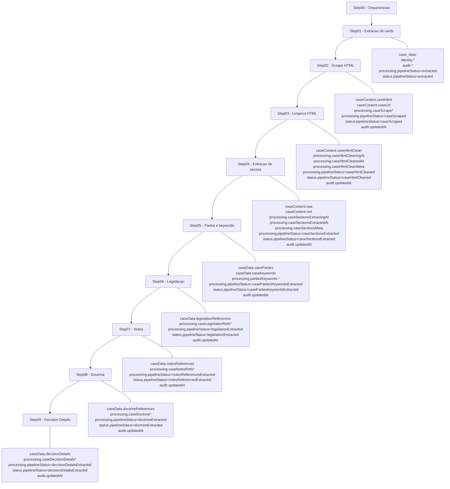

# Diagrama de Fluxo de Campos por Step (case_data)

Este diagrama mostra como os campos evoluem ao longo dos steps do pipeline, destacando o que e criado/atualizado em cada etapa.

## Observacoes
- Campos `dates` e `caseTitle` aparecem como redundancias/atalhos para consulta e nao sao diretamente produzidos por um step especifico.
- Em caso de erro em cada step, os campos de `processing.*Error` e `processing.pipelineStatus` recebem o status de erro correspondente.
